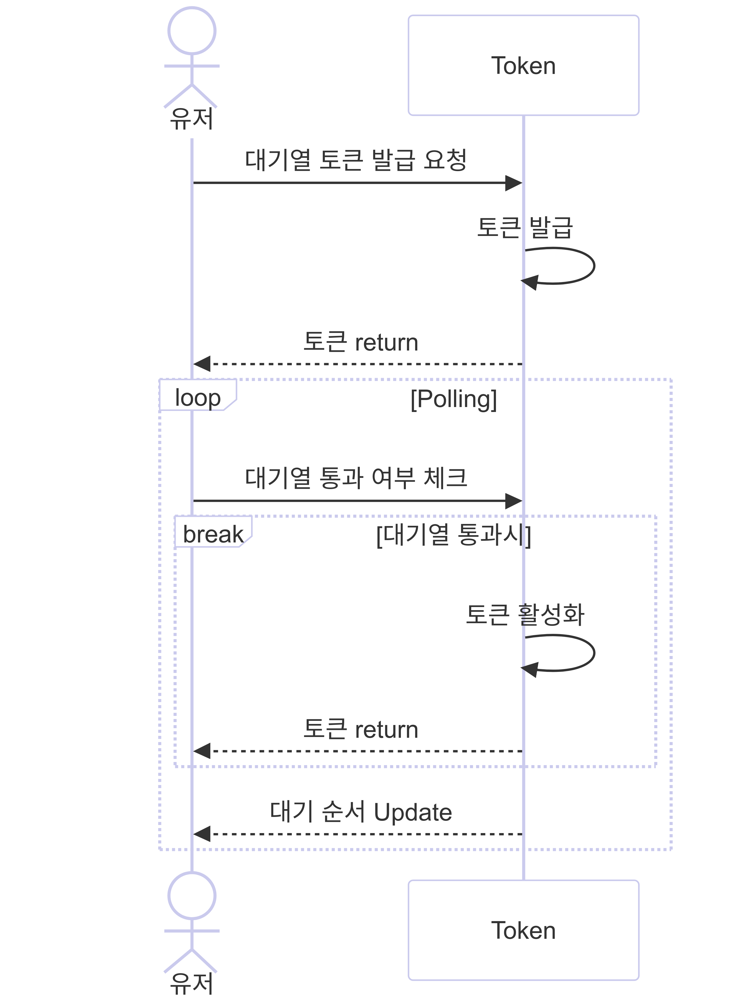

# 시나리오 분석 보고서

## Flow Chart


## Sequence Diagram

### 1. 대기열 토큰 발급


<br>

### 2. 예약 가능한 콘서트 날짜 조회


<br>

### 3. 예약 가능한 콘서트 좌석 조회


<br>

### 4. 콘서트 좌석 예약 요청


<br>

### 5. 잔액 조회


<br>

### 6. 잔액 충전


<br>

### 7. 결제 요청


<br>


## ERD


## API 명세서


## Mock API


## 프로젝트

## Getting Started

### Prerequisites

#### Running Docker Containers

`local` profile 로 실행하기 위하여 인프라가 설정되어 있는 Docker 컨테이너를 실행해주셔야 합니다.

```bash
docker-compose up -d
```

