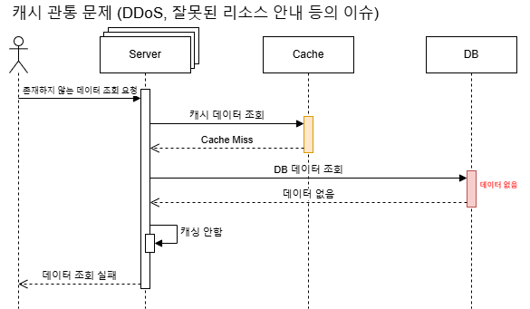

# Cache

## 캐시란?
자주 사용하는 데이터를 임시로 복사해두고 빠르게 조회하기 위한 Storage를 말한다.  
캐시를 사용하면 원본 데이터를 직접 조회하는 방식보다 더 빠르게 조회하므로 DB I/O로 인한 병목을 줄일 수 있다.

### CPU Cache

### Application Cache
CPU가 캐시를 사용하는 방식와 거의 동일하다.  
비교적 빠르고 가까운 메모리를 먼저 탐색하고나서 DB를 탐색한다.

## 주로 사용되는 캐싱 전략
### 1. Look-Aside
Cache Miss이면 DB에서 데이터를 가져와 캐시에 저장하는 방식입니다. 애플리케이션이 주도적으로 캐시를 관리한다는 특징을 가집니다.  
단, DB를 조회해도 데이터가 없는 경우 캐시가 채워지지 않아 계속해서 캐시 미스가 발생하는 경우(Cache Penetration)가 발생할 수 있습니다.

### 2. Read-Through

### 3. Write-Through

### 4. Write-Back

### 5. Write-Around

## 캐시 문제

### Cache Stampede
트래픽이 높은 시간대에 캐시가 만료되어 수많은 트래픽이 DB를 향하는 문제입니다.

- **해결 방안**
    - 캐시들의 일괄 만료 -> Jitter를 통한 만료시간 분산
    - hit rate가 높은 캐시 만료 -> 캐시 워밍을 통한 조기 업데이트

### Cache Penetration
캐시 관통은 존재하지 않는 데이터에 대한 요청으로 인해 지속적으로 Cache Miss가 발생하는 상황입니다.  
DDoS 등의 이유로 발생하기도 합니다.  

- **해결 방안**
  - Null Object Pattern (`값이 없음`을 캐싱)
  - limit rate를 이용한 요청 수 제한

