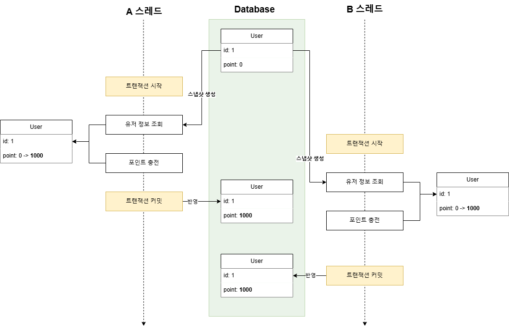

# 콘서트 예약 시스템에서의 동시성 문제 및 해결 방안
```
하기 내용에서 다루는 동시성 문제는 MySQL - Repeatable Read 격리수준을 기준으로 작성되었습니다.
```
## 1. 문제 상황

### 문제1 : 좌석 선점

```java
class SeatReservationUsecase {
  private final ConcertService concertService;
  private final ReservationService reservationService;

  public void reserveSeat(int seatId) {
    concertService.reserveSeat(seatId); // 1. 좌석 선점
    reservationService.create(seatId); // 2. 예약 생성
  }
}

class ConcertService {
  private final SeatRepository seatRepository;

  public void reserveSeat(int seatId) {
    Seat seat = seatRepository.findById(seatId);
    if (seat.isReserved()) throw new RuntimeException("이미 예약된 좌석입니다.");
    seat.reserve();
  }
}

class ReservationService {
  private final ReservationRepository reservationRepository;

  public void create(int seatId) {
    Reservation reservation = new Reservation(seatId);
    reservationRepository.save(reservation);
  }
}
```

### 트랜잭션 커밋 이전에 데이터를 조회하는 경우
A 스레드의 작업 결과가 반영되기 전의 데이터를 조회하여 중복 예약 문제가 발생합니다.


### 문제 2 : 유저 포인트 충전 / 사용
```java
class UserService {
  private final UserRepository userRepository;

  @Transactional
  public void chargePoint(Long userId, int point) {
    User user = userRepository.findById(userId);
    user.chargePoint(point);
  }

  @Transactional
  public void usePoint(Long userId, int point) {
    User user = userRepository.findById(userId);
    user.usePoint(point);
  }
}
```

### 트랜잭션 커밋 이전에 데이터를 조회하는 경우
A 스레드의 작업 결과가 반영되기 전의 데이터를 조회하므로 1000원을 2번 충전했는데 최종적으로 1000원만 남는 갱신손실 문제가 발생합니다.




## 동시성 제어 방법
좌석 예약을 예로 들자면, 예약하고자 하는 좌석에 Lock을 걸어 동시성 문제를 해결할 수 있습니다.


### 1. 배타적 락 (Exclusive Lock)
배타적 락은 데이터베이스 수준의 락으로, 다른 트랜잭션이 해당 데이터를 **읽거나 변경하지 못하도록** 합니다.  
줄여서 `x-lock`으로 불리기도 합니다.
```java
interface SeatRepository extends JpaRepository<Seat, Long> {

  @Lock(LockModeType.PESSIMISTIC_WRITE)
  @Query("select s from Seat s where s.id = :id")
  Optional<Seat> findByIdWithLock(Long id);
}
```


- **장점**
  - 다른 트랜잭션의 데이터 접근을 막아 좌석 선점에 대한 일관성을 보장
- **단점**
  - 좌석 선점 특성상 순간적으로 높은 동시성을 유발하기에 락에 의한 경합을 심하게 유발할 수 있음
  - 좌석이 이미 선점된 후에도 조회시 락이 필요함

### 2. 낙관적 락 (Optimistic Lock)
낙관적 락은 애플리케이션 수준의 락이며, 데이터를 변경하기 전에 **데이터의 버전을 체크**하여 충돌을 방지하는 방식입니다.
```java
class Seat {
  @Id
  private Long id;

  private boolean isReserved;

  @Version
  private long version;
}
```


- **장점**
  - 데이터베이스 수준의 락을 걸지 않아 높은 동시성에 대응이 비관적 락에 비해 상대적으로 수월함
  - 한번 좌석을 선점하고 나면 이후 요청은 실패해야 하기에, 재시도 전략 없이 버전 체크만으로도 무결성을 보장할 수 있음
- **단점**
  - 커밋 직전에 지연 쿼리를 실행하므로 하지 않아도 되는 예약 생성 같은 작업으로 인한 자원 낭비 발생
  - 커밋 직전에 충돌 여부를 알 수 있으므로 트랜잭션을 필요 이상으로 오래 점유하게 됨
  - 좌석 선점 특성상 트랜잭션 커밋 시도시 다수의 지연쿼리가 동시다발적으로 발생하여 DB에 부하를 줄 수 있음

### Redis를 이용한 분산락
싱글 스레드 기반인 Redis을 이용하여 분산환경에서도 Lock을 보장할 수 있도록 논리적으로 구현한 방식입니다.

```
- Lock 미반납으로 인한 데드락은 TTL을 이용하여 방지한다고 가정하였습니다.
```

### 3. Redis - Simple Lock
Redis의 Simple Lock은 key 선점 실패시 재시도를 하지 않고 요청을 실패처리하는 방식입니다.


- **장점**
  - 좌석 선점시 최초로 락을 획득한 스레드에게만 선점 기회가 주어짐
- **단점**
  - 최초로 락을 획득한 스레드가 좌석 선점에 실패하면, 동시에 들어온 요청들은 시도도 못해보고 실패하기 때문에 공정하지 않을 수 있음


### 4. Redis - Pub/Sub
Redis의 메시지 브로커로 사용하여 락을 획득한 스레드에게 이벤트를 보내 선점했음을 알려주는 방식입니다.


- **장점**
  - 스레드에서 락 획득을 위한 재시도 전략을 구현 대신 획득할때까지 대기하면 됨
- **단점**
  - 애플리케이션이 락 획득 이벤트를 성공적으로 받아서 처리했는지 알 수 없음
  - 메시지를 보내는 시점에 구독자가 없거나 애플리케이션이 다운된다면 메시지는 유실됨
  - 락 해제시 대기중인 모든 스레드가 락을 획득하기 위해 동시다발적으로 요청하며 Redis에 큰 부하를 줄 수 있음


## 사용한 Lock

### 문제1: 좌석 선점 (Simple Lock + Optimistic Lock)
`Redis - Simple Lock` + `낙관적 락`을 사용하였습니다.

- **Simple Lock을 사용한 이유**  
  좌석 선점에 성공하면 좌석이 만료되기 전까지 모든 요청은 실패해야 합니다. 즉, 재시도 전략이 필요없습니다.  
  또한 네트워크, DB I/O 이슈가 아닌 이상 좌석 선점에 실패하는 경우는 거의 없을 것이기 때문입니다.  
  그래서 최종적으로는 `Simple Lock`을 사용하는 것이 가장 합리적으로 생각되었습니다.


- **낙관적 락을 사용한 이유**  
  Redis의 `Simple Lock`을 사용하여 트랜잭션 점유를 최소화하는데는 성공하였습니다. TTL도 설정하여 데드락도 방지하였습니다.  
  하지만 스레드 지연 이슈로 혹은 TTL을 너무 짧게 잡아서 TTL이 만료된 이후에도 작업이 완료되지 않을 수도 있습니다.  
  이런 경우에는 기존의 트랜잭션이 커밋되지 않았는데도 다른 스레드가 락을 획득하고 요청을 수행하면 동시성 이슈가 발생할 수 있습니다.  
  이런 경우를 방지하기 위해 `낙관적 락`을 사용하여 동시성 이슈를 방지하고자 하였습니다.

**최종적으로**
- `Simple Lock`을 이용하여 좌석 선점 요청으로 인한 트랜잭션 수를 줄여 DB 부하를 줄이고
- 낙관적 락을 통해 TTL 만료시 발생할 수 있는 동시성 이슈를 방지하고자 하였습니다.


### 문제2: 유저 포인트 충전 / 사용 (Exclusive Lock)
`배타적 락`을 사용하였습니다.

`포인트 충전 / 사용`의 경우에는 트래픽이 크지 않으며, 동시 충전으로 인한 데이터 일관성이 깨질 수 있다는 점이 있습니다.
또한 충전,사용의 순서에 따라 잔액이 부족하여 실패할수도 있어서 최대한 요청 순서를 보장해주기 위해 `배타적 락`을 사용하였습니다.  
`(중복 요청 판별 여부는 차주에 requestId를 이용하여 처리할 예정입니다.)`


## 좌석 선점 부하 테스트
로컬 환경에서 테스트하여 일관성있지는 않지만 redis 사용 유무에 따른 대략적인 차이를 확인할 수 있었습니다.  
1개의 좌석에 대해 400번의 요청을 날려 테스트하였습니다.  
(좌석 하나만 테스트하는 점과 요청 횟수도 과한 편이라 이 부분은 차주에 다시 보완하도록 하겠습니다...)
### 서버
https_reqs(초당 처리량)만 보아도 성능이 2배 가량 차이나는 것을 알 수 있습니다.
- **Redis 미사용**  
  
  

- **Redis 사용**  
  

### DB
`Mysql Workbench` 대시보드로 대략적인 성능을 확인하였습니다.
Redis를 사용할 경우 `Simple Lock`을 사용하여 요청들이 트랜잭션을 생성하지도 못하여 전체적으로 리소스 소모량의 차이가 크게 나타납니다.
- **Redis 미사용**  


- **Redis 사용**  

