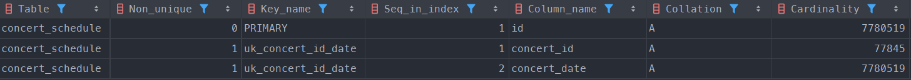
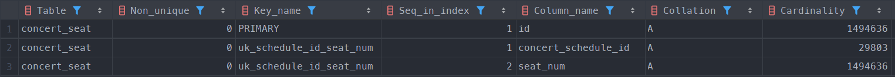
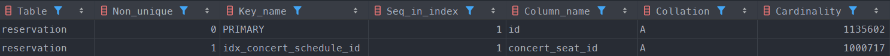

# 인덱스를 이용한 성능 개선 보고서

## 테스트 내용
- 현재 사용중인 API에 기반하여 적절한 인덱스 찾기
- 인덱스 적용시 성능 개선 여부 확인

## 인덱스 적용 기준
- 조회가 자주 발생하는가?
- 필터링에 자주 사용되는 컬럼인가?
- 카디널리티가 인덱스를 사용하기 적절한가?

## concert_schedule 테이블

|        컬럼        |               카디널리티                |                   필터링 빈도                    |               수정 빈도               |
|:----------------:|:----------------------------------:|:-------------------------------------------:|:---------------------------------:|
|  **concert_id**  | 중간 (schedule은 concert_id 기준으로 관리됨) | 높음 (schedule은 concert_id로 필터링하여 조회할 확률이 높음) | 낮음 (스케쥴이 추가되는 경우가 많고 변경되는 경우는 적음) |  
| **concert_date** |   낮음 (성수기, 비수기에 따라 분포가 치우칠 수 있음)   |     낮음 (concert_date가 많지 않아 의미 없을 수 있음)     |      낮음 (마찬가지로 수정되는 경우는 적다)       |


### 사용중인 쿼리 및 인덱스
- **사용중인 JPA 메서드**
    ```java
    @Repository
    public interface ConcertScheduleRepository extends JpaRepository<ConcertSchedule, Long> {
        // concertId로 콘서트 일정 조회
        List<ConcertSchedule> findByConcertId(long concertId);
    }
    ```

- **메서드 호출시 실행되는 쿼리**
    ```mysql
    select
        cs1_0.id,
        cs1_0.concert_date,
        cs1_0.concert_id 
    from
        concert_schedule cs1_0 
    where
        cs1_0.concert_id=?
    ```


### **사용한 인덱스**
현재 API는 concert_id 기준으로 조회하고 있고, 콘서트별 일정은 많아도 수십건 내외일것으로 예상됩니다.  
**인덱스는 concert_id만으로도 충분할 수 있으나 concert_id, concert_date 조합의 Unique Key를 활용하기로 결정하였습니다.**


- **적용한 Unique Key**
  - JPA 버전
    ```java
    @Entity
    @Table(uniqueConstraints = {
        @UniqueConstraint(name = "uk_concert_id_date", columnNames = { "concert_id", "concert_date" })
    })
    public class ConcertSchedule {
        // ...
    }
    ```
    
  - DDL 버전
    ```mysql
    ALTER TABLE concert_schedule ADD CONSTRAINT uk_concert_id_date UNIQUE (concert_id, concert_date);
    ```

### 인덱스 적용 결과

- **인덱스 통계 테이블 (데이터 갯수: 100만건)**
  
  > - **concert_date는 중복이 많은 데이터임에도 카디널리티가 PK와 동일한 이유**  
  > 인덱스 컬럼의 카디널리티는 인덱스의 이전 key와의 조합을 기준으로 정해집니다.  
  > (concert_id, concert_date) 조합은 unique하기 때문에 unique key의 마지막 필드인 concert_date의 카디널리티는 PK와 동일합니다. 


- **인덱스 미적용 실행계획**
  ```mysql
  -> Filter: (concert_schedule.concert_id = 80000)  (cost=795563 rows=97.7) (actual time=1484..1484 rows=100 loops=1)
    -> Table scan on concert_schedule  (cost=795563 rows=7.78e+6) (actual time=0.549..1286 rows=8e+6 loops=1)
  ```


- **인덱스 적용 실행계획**
  ```mysql
  -> Covering index lookup on concert_schedule using uk_concert_id_date (concert_id=80000)  (cost=11.2 rows=100) (actual time=0.0224..0.0296 rows=100 loops=1)
  ```


- **결과**
  - 스캔 방식: `Table scan` -> `Covering index lookup`
  - 쿼리 실행시간: 1584ms -> 315ms
  - 스캔한 row 개수: 80만개 -> 100개 

> - **Unique Key에 포함되지 않는 id도 조회했는데 왜 Covering Index로 동작할까?**  
> InnoDB 기준 클러스터링 인덱스의 leaf node에서 PK 값을 가지고 있습니다.  
> 즉, 인덱스만으로도 PK를 찾을 수 있기 때문에 Covering Index로 동작할 수 있습니다.


## concert_seat 테이블

|           컬럼            |                                  카디널리티                                  |                   필터링 빈도                    |           수정 빈도            |
|:-----------------------:|:-----------------------------------------------------------------------:|:-------------------------------------------:|:--------------------------:|
| **concert_schedule_id** |                  중간 (schedule단위로 좌석이 관리되므로 적절한 분포 예상)                   |         높음 (콘서트별 좌석 조회시 기준이 되는 컬럼)          |             없음             |  
|      **seat_num**       |                   중간 (성수기, 비수기에 따라 가끔씩 분포가 치우칠 수는 있음)                   | 낮음 (concert_schedule_id별 유니크한 seat_num을 가짐) |             없음             |
|       **amount**        |                     낮음 (좌석별로 가격대가 비슷한 경우가 많을 수 있음)                      |           낮음 (일반적으로 필터링에 쓰이지 않음)            |             없음             |
|     **is_reserved**     | 매우 낮음 (boolean 타입이라 중복이 매우 높음. 데이터 분포 또한 인기콘서트일수록 true로 치우칠 가능성이 매우 높음) |         높음 (콘서트 좌석 예약시 빈 좌석을 조회해야함)         | 중간 (결제가 이루어지지 않으면 예약이 취소됨) |


### 사용중인 쿼리 및 인덱스
- **사용중인 JPA 메서드**
    ```java
    @Repository
    public interface ConcertSeatRepository extends JpaRepository<ConcertSeat, Long> {
        // 선택한 일정의 예약 가능한 좌석 조회
        List<ConcertSeat> findByConcertScheduleIdAndIsReservedFalse(long concertScheduleId);
    }
    ```

- **메서드 호출시 실행되는 쿼리**
    ```mysql
        select
        cs1_0.id,
        cs1_0.amount,
        cs1_0.concert_schedule_id,
        cs1_0.is_reserved,
        cs1_0.seat_num,
        cs1_0.version 
    from
        concert_seat cs1_0 
    where
        cs1_0.concert_schedule_id=? 
        and not(cs1_0.is_reserved)
    ```


### **사용한 인덱스**
현재 API는 concert_schedule_id와 is_reserved로 조건 검색을 수행하고 있습니다.  
is_reserved는 카디널리티가 매우 낮은편이라 효율이 떨어질 뿐더러, 좌석이 수만건 이하일 경우 concert_schedule_id만으로도 충분한 성능을 보장할 수 있다고 생각합니다.  
(concert_schedule_id, seat_num) 조합의 Unique Key가 존재하기에 해당 Key를 그대로 활용하기로 하였습니다.  


- **적용한 Unique Key**
  - JPA 버전
    ```java
    @Entity
    @Table(uniqueConstraints = {
        @UniqueConstraint(
            name = "uk_schedule_id_seat_num",
            columnNames = { "concert_schedule_id", "seat_num" }
    )})
    public class ConcertSeat {
        // ...
    }
    ```

  - DDL 버전
    ```mysql
    ALTER TABLE concert_seat ADD CONSTRAINT uk_schedule_id_seat_num UNIQUE (concert_schedule_id, seat_num);
    ```

### 인덱스 적용 결과

- **인덱스 통계 테이블 (데이터 갯수: 150만건)**
  


- **인덱스 미적용 실행계획**
  ```mysql
  -> Filter: ((cs1_0.is_reserved = 0) and (cs1_0.concert_schedule_id = 100))  (cost=151447 rows=5.14) (actual time=1.39..314 rows=14 loops=1)
    -> Table scan on cs1_0  (cost=151447 rows=1.49e+6) (actual time=0.542..268 rows=1.5e+6 loops=1)
  ```


- **인덱스 적용 실행계획**
  ```mysql
  -> Filter: (cs1_0.is_reserved = 0)  (cost=14.4 rows=5) (actual time=0.133..0.139 rows=14 loops=1)
    -> Index lookup on cs1_0 using uk_schedule_id_seat_num (concert_schedule_id=100)  (cost=14.4 rows=50) (actual time=0.0815..0.0856 rows=50 loops=1)
  ```


- **결과**
  - 스캔 방식: `Table scan` -> `Index lookup`
  - 쿼리 실행시간: 606ms -> 177ms
  - 스캔한 row 개수: 150만개 -> 50개


## reservation 테이블

|         컬럼          |                        카디널리티                         |           필터링 빈도            |             수정 빈도              |
|:-------------------:|:----------------------------------------------------:|:---------------------------:|:------------------------------:|
| **concert_seat_id** | 높음 (예약 취소로 인해 동일 좌석별 여러 예약이 존재할 수는 있으나 거의 없을것으로 예상됨) |             낮음              |               없음               |  
|     **user_id**     |          중간 (헤비유저의 경우 예약이 많아 분포가 치우칠 수 있음)           | 높음 (유저 단위로 예약 리스트 조회할 수 있음) |               없음               |
|     **amount**      |            낮음 (좌석별로 가격대가 비슷한 경우가 많을 수 있음)            |             낮음              |               없음               |
|     **status**      |            낮음 (ENUM값으로 관리되기 때문에 중복도가 높음)             |             낮음              |    높음 (예약 확정, 만료시 무조건 수정됨)     |
|   **created_at**    |                높음 (생성시간이 동일한 경우는 적음)                 |             낮음              |        없음 (데이터 생성시 정해짐)        |
|     **paid_at**     |              약간 높음 (시간이 동일한 경우는 거의 없음)               |             낮음              | 낮음 (결제가 성공하면 결제시간이 최초 한번만 기록됨) |


### 사용중인 쿼리 및 인덱스
- **사용중인 JPA 메서드**
    ```java
    @Repository
    public interface ReservationRepository extends JpaRepository<Reservation, Long> {
        List<Reservation> findByConcertSeatIdAndStatus(long concertSeatId, ReservationStatus reservationStatus);
    }
    ```

- **메서드 호출시 실행되는 쿼리**
    ```mysql
    select
        r1_0.id,
        r1_0.amount,
        r1_0.concert_seat_id,
        r1_0.created_at,
        r1_0.paid_at,
        r1_0.status,
        r1_0.user_id,
        r1_0.version 
    from
        reservation r1_0 
    where
        r1_0.concert_seat_id=? 
        and r1_0.status=?
    ```


### **사용한 인덱스**
현재 쿼리는 concert_seat_id와 status를 조합하여 조건 검색을 수행하고 있습니다.  
status는 ENUM값으로 관리디어 카디널리티가 낮은 편이고, 각 좌석당 발생하는 예약은 아무리 많아도 5건 내외입니다.  
concert_seat_id만으로도 충분히 빠를것으로 예상되어 concert_seat_id 단일 인덱스를 추가하였습니다.   


- **적용한 Unique Key**
  - JPA 버전
    ```java
    @Entity
    @Table(
        name = "reservation",
        indexes = { @Index(name = "idx_concert_schedule_id", columnList = "concert_schedule_id") }
    )
    public class Reservation {
        // ...
    }
    ```

  - DDL 버전
    ```mysql
    ALTER TABLE reservation ADD INDEX idx_concert_schedule_id (concert_seat_id);
    ```

### 인덱스 적용 결과

- **인덱스 통계 테이블 (데이터 갯수: 110만건)**
  


- **인덱스 미적용 실행계획**
  ```mysql
  -> Filter: ((r1_0.`status` = 'WAITING') and (r1_0.concert_seat_id = 1000))  (cost=114891 rows=1) (actual time=265..265 rows=0 loops=1)
    -> Table scan on r1_0  (cost=114891 rows=1.14e+6) (actual time=0.146..227 rows=1.14e+6 loops=1)
  ```


- **인덱스 적용 실행계획**
  ```mysql
  -> Filter: (r1_0.`status` = 'WAITING')  (cost=0.26 rows=0.1) (actual time=0.0488..0.0488 rows=0 loops=1)
    -> Index lookup on r1_0 using idx_concert_schedule_id (concert_seat_id=1000)  (cost=0.26 rows=1) (actual time=0.0247..0.0261 rows=1 loops=1)
  ```


- **결과**
  - 스캔 방식: `Table scan` -> `Index lookup`
  - 쿼리 실행시간: 508ms -> 172ms
  - 스캔한 row 개수: 114만개 -> 1개


