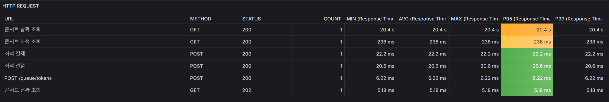
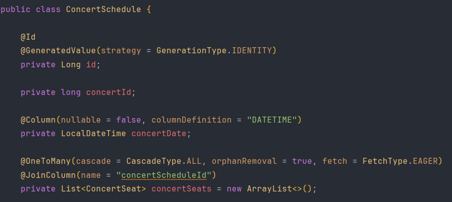
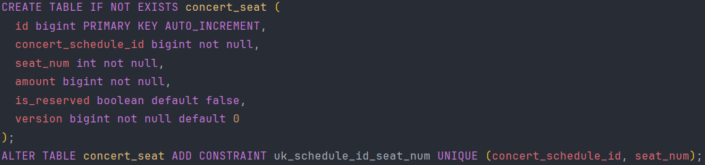
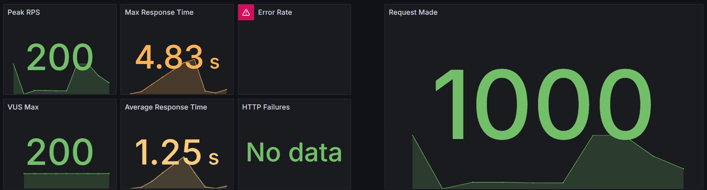
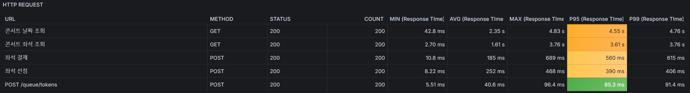

# 부하 테스트 및 성능 병목 개선 보고서
본 문서는 부하 테스트를 통한 성능 병목 지점과 그에 대한 개선 사항을 작성한 문서입니다.

## 주요 시나리오
대기열 기반 콘서트 좌석 예약 서비스는 다음과 같은 시나리오를 가집니다.

```
1. 대기열 토큰 발급
2. 콘서트 날짜 조회
3. 콘서트 좌석 조회
4. 콘서트 좌석 선점
5. 좌석 결제
```

대기열 트래픽이 발생하는 중에도 대기열을 통과한 유저들은 이후의 기능들을 정상적으로 사용할 수 있어야 합니다.  
그래서 예약 시나리오 전체`(대기열 토큰 발급 ~ 좌석 결제)`를 테스트하며 병목 구간을 탐색합니다.

## 병목 발생 우려 지점
부하테스트 진행시 성능 병목이 예상되는 리스트입니다.

### 1. 대기열 토큰 발급 API
`POST /queue/tokens`  
대기열 토큰 발급 API는 대기열 기반 시스템에서 부하를 가장 많이 발생하는 구간입니다.  
특정 시점에 트래픽이 급증하는 패턴이 나타납니다.

### 2. 대기열 토큰 조회 기능
콘서트 관련 API는 대기열을 통과해야 사용 가능합니다.  
API 요청시 `Spring Interceptor`로 대기열 토큰을 체크하기 때문에 해당 기능에서 지속적으로 부하가 발생합니다.

### 3. 콘서트 일정 조회 API
`GET /concerts/{concertId}/available-dates`
콘서트 일정을 조회하는 API입니다.

### 4. 콘서트 좌석 조회 API
`GET /concerts/{concertId}/schedules/{concertScheduleId}/available-seats`
콘서트 좌석을 조회하는 API입니다.

### 5. 좌석 선점 API
`POST /reservation/concerts`  
인기 콘서트에 대한 좌석 선점은 대기열 여부를 떠나 동시성이 높을 확률이 큽니다.

### 5. 좌석 결제 API
`POST /reservation/payments`  
선점한 좌석을 최종적으로 결제할 때 사용하는 API입니다.


## 좌석 예약 시나리오
좌석 예약 시나리오를 테스트하여 다음 사항을 확인합니다.
- **대기열을 통한 트래픽 제어가 안정적인지 확인** 
- **전체 서비스의 안정적인 동작 확인**  

부하테스트를 진행하자마자 문제가 생겼습니다. 콘서트 날짜 조회를 진행하면 대부분의 요청이 실패하였습니다.

### 1. 문제 상황
부하테스트 대신 단건으로 `콘서트 날짜 조회`를 해도 20초 가량 걸리는 상황이 발생했습니다.  




### 2. 원인 분석
`ConcertSeat` 엔티티에서 `ConcertSchedule` 엔티티를 조인하는 상황에서 문제가 발생하고 있었습니다.  
데이터를 즉시 로딩하도록 설정하여 join으로 인해 쿼리가 느려지는 상황이었습니다.


하지만 조인을 하더라도 20초나 느려지는 상황은 비정상적입니다.  
그래서 `ConcertSeat`, `ConcertSchedule`의 인덱스를 확인해보았고, `ConcertSchedule`의 인덱스가 누락되었음을 확인할 수 있었습니다.  

### 3. 개선 방안
`ConcertSchedule` 엔티티에 조회에 필요한 인덱스(`uk_schedule_id_seat_num`)를 추가하여 조회 및 조인 성능을 높였습니다.




## 문제 개선 후 부하테스트 결과

### 1. 부하테스트 환경
총 200명의 사용자가 콘서트 예약 시나리오를 진행하는 상황을 가정하였습니다.  
콘서트 예매가 열리자마자 동시에 트래픽이 발생할 것이므로 `shared-iterations`로 모든 트래픽이 동시에 들어온다고 가정하였습니다.

- **유저 수: 200명**
- **최대 실행 시간: 10초**
```js
export const options = {
  scenarios: {
    burst_traffic: {
      executor: 'shared-iterations',
      vus: 200, // 동시에 실행할 사용자 수
      iterations: 200, // 총 200개의 요청을 한 번에 실행
      maxDuration: '10s', // 최대 10초 동안 실행
    },
  },
};
```

### 2. 테스트 스크립트
API별 함수는 모듈 단위로 분리하였습니다. [링크](../k6/api)
- [callAPI - API 요청 모듈](../k6/api/callApi.js)
- [signToken - 대기열 토큰 발급 API](../k6/api/signToken.js)
- [findAvailableDates - 콘서트 일정 조회 API](../k6/api/findAvailableDates.js)
- [findAvailableSeats - 콘서트 좌석 조회 API](../k6/api/findAvailableSeats.js)
- [seatReservation - 콘서트 좌석 선점 API](../k6/api/seatReservation.js)
- [seatPayment - 결제 API](../k6/api/seatPayment.js)
```js

const getRandomItem = (arr) => arr[Math.floor(Math.random() * arr.length)];

export default async () => {
  const userId = Math.floor(Math.random() * 50) + 1; // 최대 50의 랜덤 숫자
  const concertId = Math.floor(Math.random() * 300) + 1; // 최대 300의 랜덤 숫자

  // 1. 대기열 토큰 발급
  const queueToken = signToken(userId);
  sleep(1);

  // 2. 콘서트 날짜 조회
  const schedules = await findAvailableDates(concertId, queueToken);
  if (!schedules) {
    failFindScheduleCount.add(1);
    return;
  }
  if (schedules.reason) {
    console.log(schedules.reason)
    failFindScheduleCount.add(1);
    return;
  }
  if (schedules.length === 0) {
    failFindScheduleCount.add(1);
    return;
  }
  const schedule = getRandomItem(schedules);
  sleep(1);

  // 3. 콘서트 좌석 조회
  const seats = await findAvailableSeats(schedule.concertId, schedule.concertScheduleId, queueToken);
  if (!seats) {
    failFindSeatCount.add(1);
    return;
  }
  if (seats.length === 0) {
    console.error(seats.reason)
    failFindSeatCount.add(1);
    return;
  }
  const seat = getRandomItem(seats);
  sleep(1);

  // 4. 콘서트 좌석 선점
  const reservation = await seatReservation(userId, seat.id, seat.amount, queueToken);
  if (reservation.code) {
    console.log(reservation.reason)
    failReservationCount.add(1);
    return;
  }
  sleep(1);

  // 5. 좌석 결제
  const paymentResp = await seatPayment(userId, reservation.reservationId, queueToken);
  if (paymentResp.code) {
    console.log(paymentResp.reason)
    failPaymentCount.add(1);
    return;
  }
  successCount.add(1);

}
```

### 3. 부하테스트 결과
총 5개의 API를 호출하며, 대기열 통과하지 못한다면 Polling으로 체크하기 때문에 **유저당 최소 5번의 요청이 발생**합니다.  
총 1000개의 요청이 발생하였으며, 평균 응답 시간은 `1.25` 초입니다.




다음으로 API별 성능을 확인합니다.

**부하테스트는 안정적으로 성공**하였으나, **조회 API에서 성능 저하가 발생**하고 있으며 P95와 P99 수치가 좋지 않은 편입니다.  
**부하테스트 이상의 트래픽이 들어오면 타임아웃이 발생할 확률이 높습니다.**



### 4. 향후 개선 방안
- **캐싱 정책 적용**
  - 조회 API의 P95, P99 수치가 좋지 않으므로 캐시를 이용하여 조회 성능을 높이는 것이 좋을듯 합니다.
  

- **Auto-Scaling을 이용한 Scale-Out 적용**
  - Scale-Out으로 가용성과 확장성을 챙길 수 있습니다.
  - 서버 인스턴스가 증설되면 부하 분산이 가능해져 성능 향상에 기여할 수 있습니다.
  - 증가하는 트래픽을 유연하게 대처할 수 있습니다.


- **이벤트를 이용한 비동기 작업 처리**
  - SAGA 패턴 등을 구현하여 스레드별 점유 시간을 짧게 유지하여 타임아웃되는 요청을 줄일 수 있습니다.
