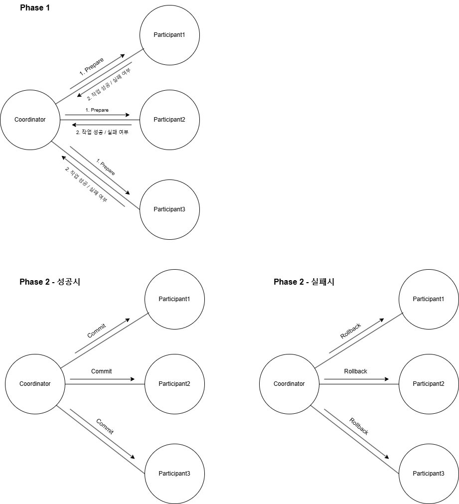

# MSA 전환시 분산 트랜잭션 전략 
이번 글에서는 기존의 모놀리식으로 설계되어 있던 서비스를 MSA의 형태로 도메인별 배포단위를 분리하는 방식에 대해 살펴본다.  
그로 인해 트랜잭션의 일관성이 깨지는 문제에 대한 해결방안에 대해서도 알아보자.

## 기존 모놀리식 구조의 장단점

### 장점
- 도메인별 트랜잭션 제어를 직접 할 수 있다. (트랜잭션에 대한 일관성이 보장된다)
- 그로 인한 데이터 일관성이 보장된다.
- 유지보수가 상대적으로 쉽다.

### 단점
- 유연성, 확장성이 떨어진다.
- 서비스간 결합도가 높다.
- 부분 배포가 불가능해서 배포시간도 오래걸린다.


## 2PC (2-Phase Commit)
트랜잭션을 종류하는 조율자(Coordinator)가 참여자(Participant)의 커밋 및 롤백을 조율한다.  
작업을 먼저 실행시키고, 작업 완료 여부에 따라 일괄적으로 commit/rollback을 실행한다.


### 특징
- 트랜잭션을 유지하기에 강한 일관성을 보장한다.
- 동기방식으로 모든 트랜잭션을 유지하므로 모든 서비스가 작업이 완료될 때까지 트랜잭션을 유지한다.
- 참여하는 모든 서비스가 응답해야 커밋 가능하기 때문에 장애에 취약하다.


### 의사 코드

- **Coordinator (조율자)**
```java
class CommitCoordinator {

    List<TransactionParticipant> participants;

    public boolean execute() {
        boolean allPrepared = true;
        
        // Phase1: 모든 작업자에게 커밋 준비 요청
        for (TransactionParticipant participant : participants) {
            // 하나라도 준비 실패하면 전부 취소
            if (!participant.prepare()) {
                allPrepared = false;
                break;
            }
        }
        
        // Phase2: 커밋 준비 여부에 따라 commit 혹은 rollback
        if (allPrepared) {
            for (TransactionParticipant participant : participants) {
                participant.commit();
            }
            return true;
        } else {
            for (TransactionParticipant participant : participants) {
                participant.rollback();
            }
            return false;
        }
    }
}
```

- **Participant (작업자)**
```java
interface TransactionParticipant {
    boolean prepare(); // 작업 준비
    boolean commit(); // 커밋 수행
    void rollback(); // 롤백 수행
}

class AService implements TransactionParticipant {
	// ...
}

class BService implements TransactionParticipant {
	// ...
}
```


## SAGA
각 서비스가 개별적으로 트랜잭션을 책임지며, 실패시 보상 트랜잭션을 수행하는 방식이다.  
2PC 방식이랑 다르게 각 서비스가 독립적으로 책임을 가진다는게 가장 큰 특징이다.  


### Orchestration (오케스트레이션)
유즈케이스의 흐름을 직접 제어하며 각 작업(트랜잭션) 성공시 보상 트랜잭션을 준비해놓는 방식이다.

- **장점**
  - 트랜잭션의 흐름이 한곳에서 명확하게 관리된다.
  - 흐름의 관리가 쉽다보니 추적 및 디버깅도 쉽다.
  - 보상 트랜잭션의 관리가 수월하다.

- **단점**
  - 모든 서비스가 오케스트레이션에 의존하므로 단일 장애점이 될 수 있다.
  - 서비스간 결합도가 높고 확장성이 떨어진다.

```java
@RequiredArgsConstructor
@Component
public class ReservationFacade {

    private final ReservationService reservationService;
    private final ConcertService concertService;
    private final CompensationProvider compensationProvider;
    
    public ReservationResult reserve(ReserveSeatDto dto) {
        // 작업 수행
        ConcertSeatResult concertSeat = concertService.reserveSeat(dto.seatId());
        // 작업 성공에 대한 보상 작업 추가
        compensationProvider.add(() -> concertService.unReserveSeat(concertSeat.id()));
    
        CreateReservationDto reservationDto = new CreateReservationDto(
                concertSeat.id(), dto.userId(), concertSeat.amount(), dto.date());
        return reservationService.reserve(reservationDto);
    }
}
```


### Choreography (코레오그래피)
각 서비스가 자체적으로 이벤트를 발행하고, 이를 다른 서비스가 구독하여 다음 작업을 이어가는 방식

- **장점**
  - 분산된 방식으로 서비스 간 결합도가 낮아서 확장성이 뛰어나다.
  - 장애로 인해 전체 서비스가 다운되지 않는다.

- **단점**
  - 서비스의 전체적인 흐름을 파악하기 어렵다.
  - 장애 발생시 추적이 어렵고 작업의 일관성 유지가 어렵다.
  - 보상 트랜잭션의 관리가 어렵다.


```java
// Concert 도메인

@RequiredArgsConstructor
@Service
public class ConcertService {

    private final ConcertSeatRepository concertSeatRepository;
    private final ConcertScheduleRepository concertScheduleRepository;
    private final ApplicationEventPublisher applicationEventPublisher;
    
    // 6. 좌석 해제
    @Transactional
    public void unReserveSeat(ReservedfailedPayload payload) {
        concertSeatRepository.updateSeatReservableById(payload.concertSeatId);
    }
    
    // 1. 좌석 예약
    @Transactional
    public ConcertSeatResult reserveSeat(long seatId) {
        // ...
        seat.reserve();
        applicationEventPublisher.publishEvent(SeatReservedEvent.from(seat));
        return ConcertSeatResult.from(seat);
    }
}

@RequiredArgsConstructor
@Component
public class ReservationFailedListener {
    
    private final ConcertService concertService;

    // 5. 좌석 해제 이벤트 수신
    @Async
    @TransactionalEventListener(phase = TransactionPhase.AFTER_COMMIT)
    public void ReservationFailedHandler(ReservedfailedEvent event) {
        ConcertService.unReserveSeat(SeatReservedPayload.from(event));
    }
}


// ------------------------------------------------------

// Reservation 도메인

@RequiredArgsConstructor
@Component
public class SeatReservedListener {

    private final ReservationService reservationService;

    // 2. 좌석 예약 이벤트 수신
    @Async
    @TransactionalEventListener(phase = TransactionPhase.AFTER_COMMIT)
    public void seatReservedHandler(SeatReservedEvent event) {
        reservationService.reserve(SeatReservedPayload.from(event));
    }
}

@RequiredArgsConstructor
@Service
public class ReservationService {

    private final ReservationRepository reservationRepository;
    private final ApplicationEventPublisher applicationEventPublisher;
    
    private final TimeProvider timeProvider;

	// 3. 예약 생성
    @Transactional
    public ReservationResult reserve(SeatReservedPayload event) {
        try {   
            List<Reservation> duplicateReservations = reservationRepository.findByConcertSeatIdAndStatus(dto.seatId(), ReservationStatus.WAITING);
            if (!duplicateReservations.isEmpty()) {
                throw new CustomException(ReservationErrorCode.ALREADY_SEAT_RESERVATION);
            }
    
			// 예약 생성 성공
            Reservation reservation = reservationRepository.save(event.to(timeProvider.now()));
            return ReservationResult.from(reservation);
        } catch (Exception e) {
			// 4. 예약 실패 이벤트 발행
            applicationEventPublisher.publishEvent(ReservationFailedEvent.from(event));
            throw e;
        }

    }
}
```
