# Redis를 이용한 성능 개선 보고서
본 보고서는 Redis를 이용하여 콘서트 예약 서비스의 성능 개선을 위한 내용을 서술합니다.

```
목차
1. 대기열 기능 DB -> Redis 이관
2. 콘서트 인기순위 API 설계
```

## 성능 개선 포인트
콘서트 예약 서비스에서 Redis를 이용한 성능 개선이 필요한 포인트는 크게 2가지로 생각하였습니다.

- **자주 발생하는 쿼리인가?** (DB 리소스 소모 관점)
- **조회가 오래 걸리는 쿼리인가?** (슬로우 쿼리 관점)

## 1. 대기열 기능 DB -> Redis 이관
**대기열은 최전선에서 모든 트래픽을 받아내기 때문에, DB 커넥션을 많이 소모합니다.**  
> - **대기열 토큰 발급 부하테스트 - MySQL 모니터링 결과**  
> 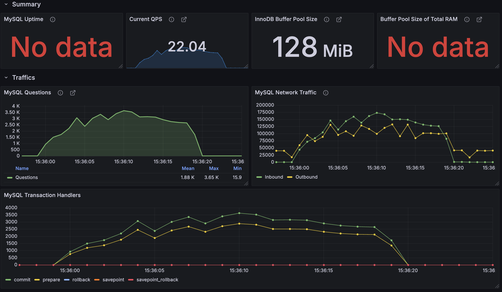
> 대기열을 이용하면 좌석 선점같은 주요 기능들에 대한 트래픽을 줄일 수 있겠지만, 결국 대기열에 대한 트래픽은 DB에 그대로 가해집니다.   
> **서비스가 성장할 수록 대기열 트래픽은 더욱 심해질 것이며, 이는 DB의 성능 병목으로 이어져 핵심 기능에도 영향을 끼칠거라고 생각했습니다.**


상기 서술한 이유로 대기열의 책임을 Redis가 가져가도록 하였습니다.  
또한 핵심 서비스에 대해 DB가 안정적으로 부하를 받도록 하는것이 중요하다고 판단하여 대기열 방식을 변경하였습니다.  
변경사항을 요약하면 아래와 같습니다.  

- **대기열 기능 관리 주체 변경 (DB -> Redis)**  
- **최대 동시 접속자수 제한 (은행창구 방식) -> 단위 시간당 대기열 통과 인원 제한 (놀이공원 방식)**
- **대기중인 대기열 자료구조 : Sorted Set (`Score = 토큰 생성 시간`)**
- **활성화 대기열 자료구조 : Sorted Set (`Score = 토큰 만료 시간`)**
 

### 대기열 토큰 발급 기능
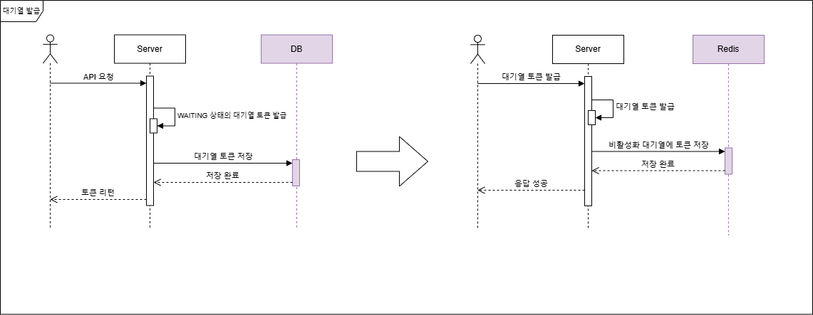

### 대기열 토큰 검증 변경사항
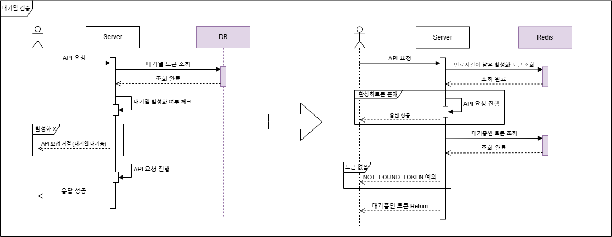

### 대기열 활성화 스케쥴러 변경사항
토큰 활성화는 아래와 같은 과정을 거칩니다.
1. 활성화 대기열에 토큰 추가
2. 비활성화 대기열에서 해당 토큰 삭제

이와 같이 하게 되면 1번과 2번 사이에 잠시동안 두 대기열에 토큰이 중복으로 존재하게 됩니다.  
이렇게 구현한 이유는 **2번 작업을 먼저 수행하게 되면 잠시동안 어떤 대기열에도 토큰이 존재하지 않게 됩니다.**  
토큰 검증은 활성화 대기열을 먼저 조회하기 때문에 잠시 중복으로 존재하더라도 문제가 없을것이라고 생각했습니다.  

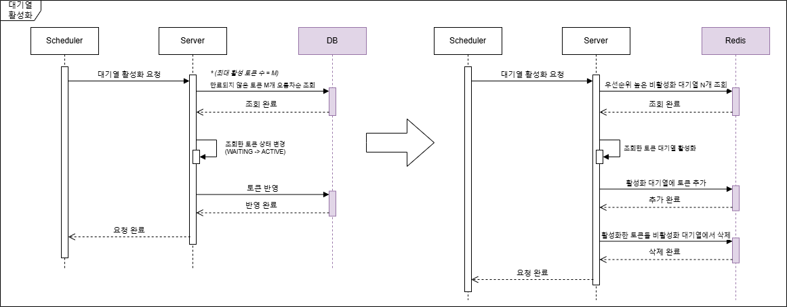

### 대기열 만료 스케쥴러 변경사항
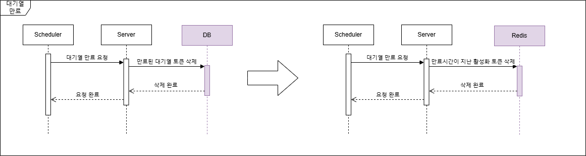

### 부하테스트 - Response Time
- **부하테스트 조건**
  - 초당 유저수: 100VU
  - 테스트 시간: 10초
  - 총 응답 수: 1000 requests

**평균 응답속도가 (19.09ms -> 2.93ms)로 약 6.5배 가량 감소**한 것을 확인할 수 있습니다.  

> - **DB 대기열**  
> 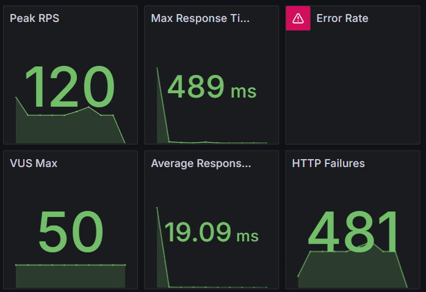
> - **Redis 대기열**  
> 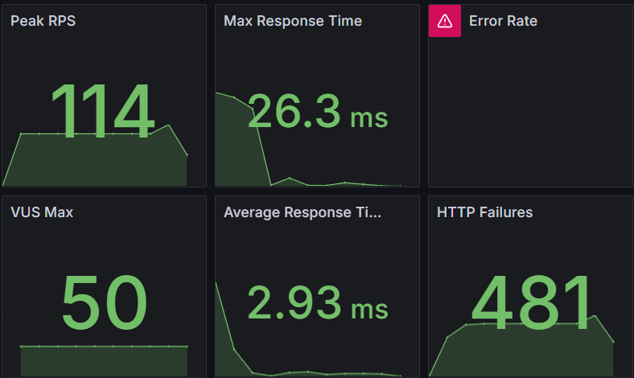


### 부하테스트 - MySQL
대기열 기능 개선 후 가장 체감되는 결과는 데이터베이스였습니다.  
평균 Query 발생량과 트랜잭션의 감소가 두드러지게 눈에 띕니다.

> - **DB 대기열**  
> 테스트 시간 동안 대기열에 의한 트랜잭션이 계속해서 발생합니다.
> 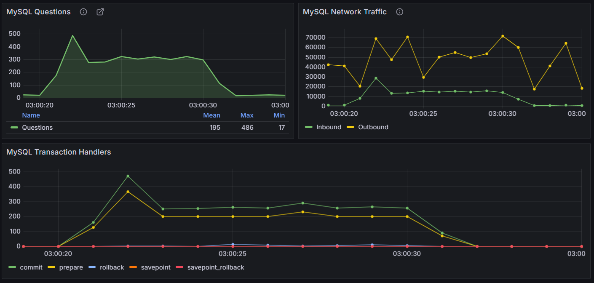
> - **Redis 대기열**  
> Redis로 변경 후에는 좌석선점으로 보이는 트랜잭션을 제외하고는 트랜잭션이 거의 발생하지 않습니다.  
> 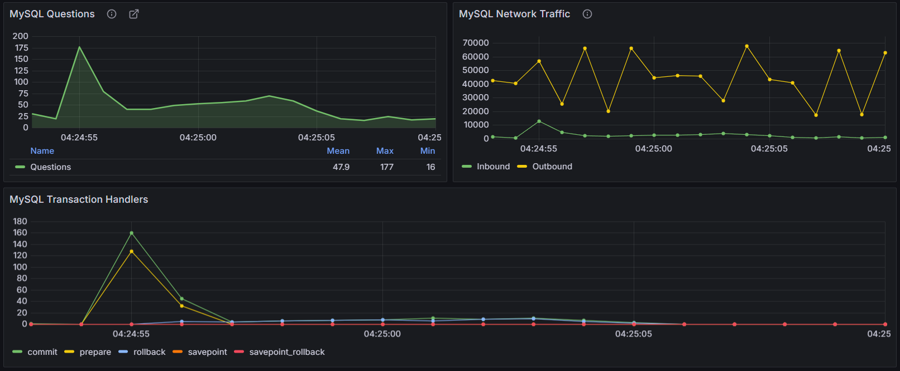


## 1-2. 콘서트 인기 리스트 조회
콘서트 예약 서비스는 대기열로 트래픽이 제어되기 때문에 캐시의 중요도가 상대적으로 떨어지는 편입니다.  
캐시를 적용해본다면 `콘서트 인기 리스트` API를 만들어 캐시를 적용해보는것도 괜찮다고 판단하여 채택하였습니다. 

### 캐시 전략
인기 리스트같은 기능은 일반적으로 `실시간`, `일간`, `주간`, `월간`같이 주기가 정해져 있습니다.  
실시간이라 할지라도 결국 실시간에 가까울뿐 빠른 주기로 캐시를 업데이트 하는 방식입니다.  
그렇기에 **스케쥴러를 이용한 캐시를 업데이트를 기본으로 하되, Look-Aside 방식으로 조회하는 방식**이 적절하다고 생각하였습니다.  
  
### 콘서트 인기순위 캐싱 스케쥴러
- 스케쥴러는 00:00분에 실행하여 이전날 인기 콘서트 캐싱
- 일간 기준 만료시간은 다음날 00:05분

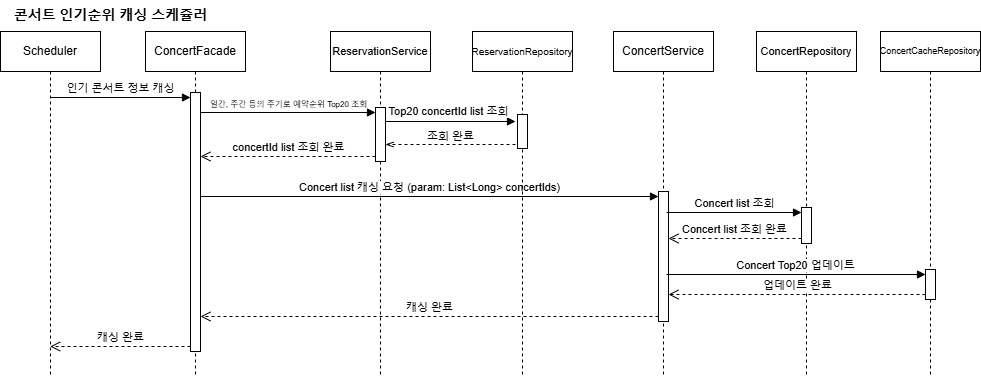

### 2. 콘서트 인기순위 API 설계
Look-Aside 방식으로 설계하였습니다.  
캐시 데이터를 우선 조회하되, 캐시 시스템이 죽거나 Cache Miss가 발생할 경우 DB를 이용하도록 하였습니다. 

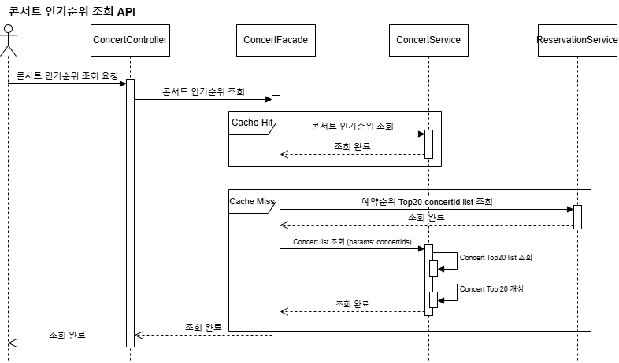
