## 대기열 토큰 발급
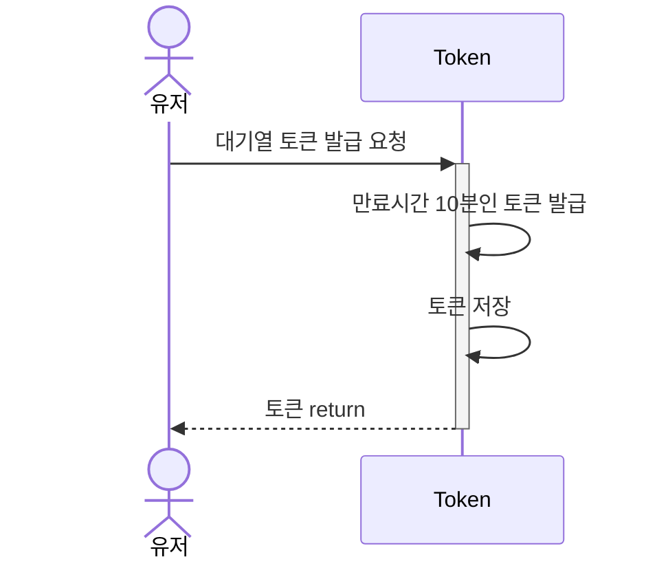
```mermaid
sequenceDiagram
  actor A1 as 유저
  participant Token as Token

  A1 ->>+ Token: 대기열 토큰 발급 요청
  Token ->> Token: 만료시간 10분인 토큰 발급
  Token ->> Token: 토큰 저장
  Token -->>- A1: 토큰 return
```

## 대기열 토큰 검증 및 갱신
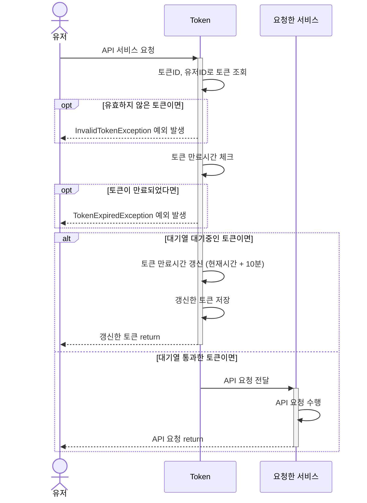
```mermaid
sequenceDiagram
  actor A1 as 유저
  participant Token as Token
    participant Request as 요청한 서비스

  A1 ->>+ Token: API 서비스 요청
  Token ->> Token: 토큰ID, 유저ID로 토큰 조회
  opt 유효하지 않은 토큰이면
    Token -->> A1: InvalidTokenException 예외 발생
  end
  Token ->> Token: 토큰 만료시간 체크
  opt 토큰이 만료되었다면
    Token -->> A1: TokenExpiredException 예외 발생
  end
  alt 대기열 대기중인 토큰이면
      Token ->> Token: 토큰 만료시간 갱신 (현재시간 + 10분)
      Token ->> Token: 갱신한 토큰 저장
      Token -->>- A1: 갱신한 토큰 return
      
      else 대기열 통과한 토큰이면
      Token ->>+ Request: API 요청 전달
      Request ->> Request: API 요청 수행
      Request -->>- A1: API 요청 return
  end
```

## 대기중인 토큰 활성화 스케쥴러
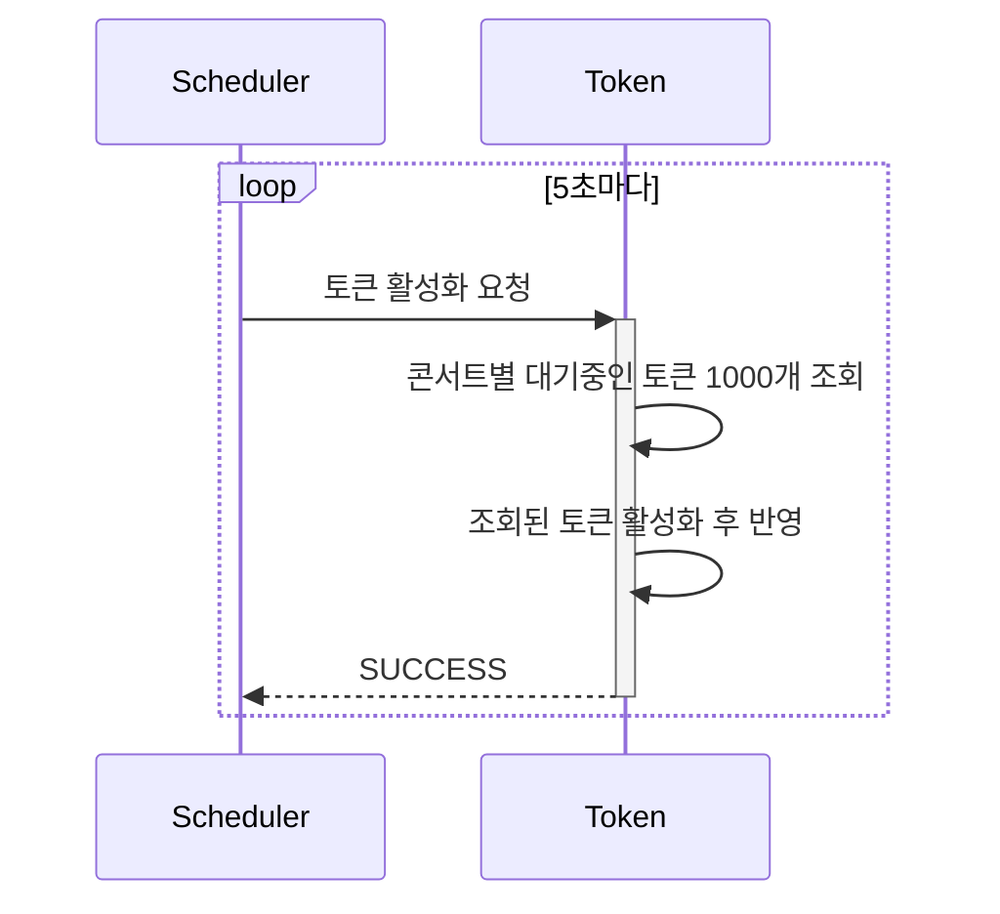
```mermaid
sequenceDiagram
    participant Scheduler as Scheduler
    participant Token as Token

    loop 5초마다
        Scheduler ->>+ Token: 토큰 활성화 요청
        Token ->> Token: 콘서트별 대기중인 토큰 1000개 조회
        Token ->> Token: 조회된 토큰 활성화 후 반영
        Token -->>- Scheduler: SUCCESS
    end
```

## 만료된 토큰 삭제 스케쥴러
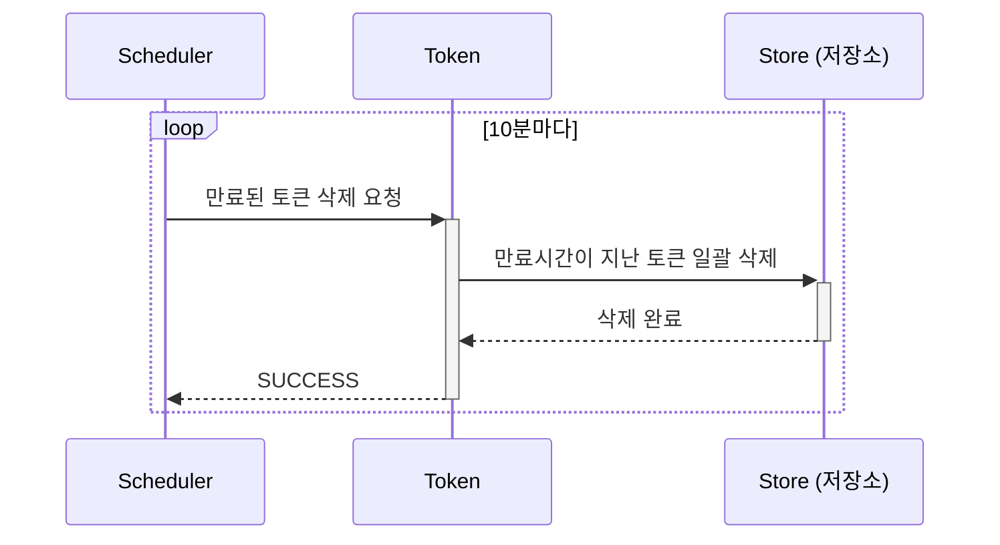
```mermaid
sequenceDiagram
    participant Scheduler as Scheduler
    participant Token as Token
    participant Store as Store (저장소)

    loop 10분마다
        Scheduler ->>+ Token: 만료된 토큰 삭제 요청
        Token ->>+ Store: 만료시간이 지난 토큰 일괄 삭제
        Store -->>- Token: 삭제 완료
        Token -->>- Scheduler: SUCCESS
    end
```

## 만료된 예약의 좌석 배정 해제 스케쥴러
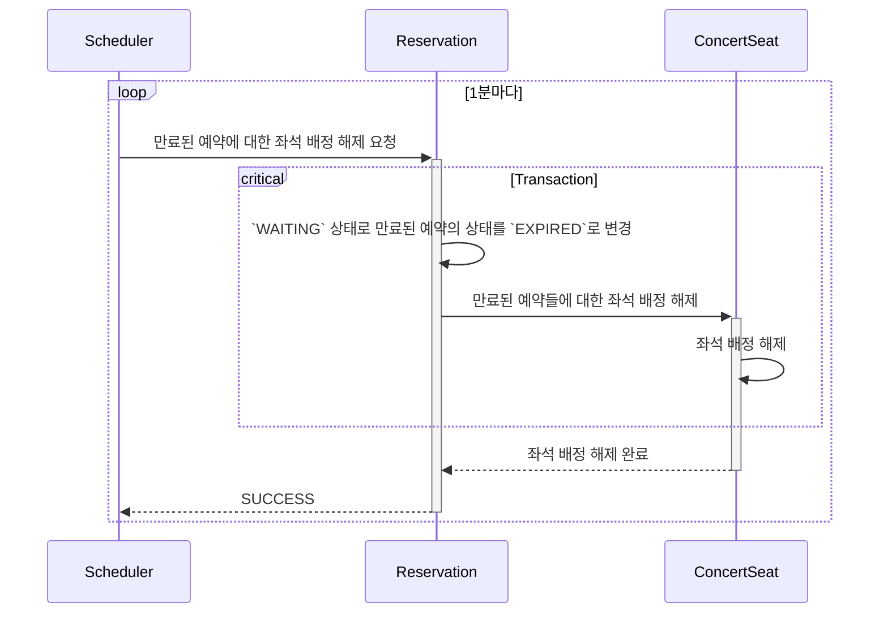
```mermaid
sequenceDiagram
    participant Scheduler as Scheduler
    participant Reservation as Reservation
    participant ConcertSeat as ConcertSeat

    loop 1분마다
        Scheduler ->>+ Reservation: 만료된 예약에 대한 좌석 배정 해제 요청
        critical Transaction
            Reservation ->> Reservation: `WAITING` 상태로 만료된 예약의 상태를 `EXPIRED`로 변경
            Reservation ->>+ ConcertSeat: 만료된 예약들에 대한 좌석 배정 해제
            ConcertSeat ->> ConcertSeat: 좌석 배정 해제
        end
        ConcertSeat -->>- Reservation: 좌석 배정 해제 완료
        Reservation -->>- Scheduler: SUCCESS
    end
```

## 예약 가능 날짜 조회
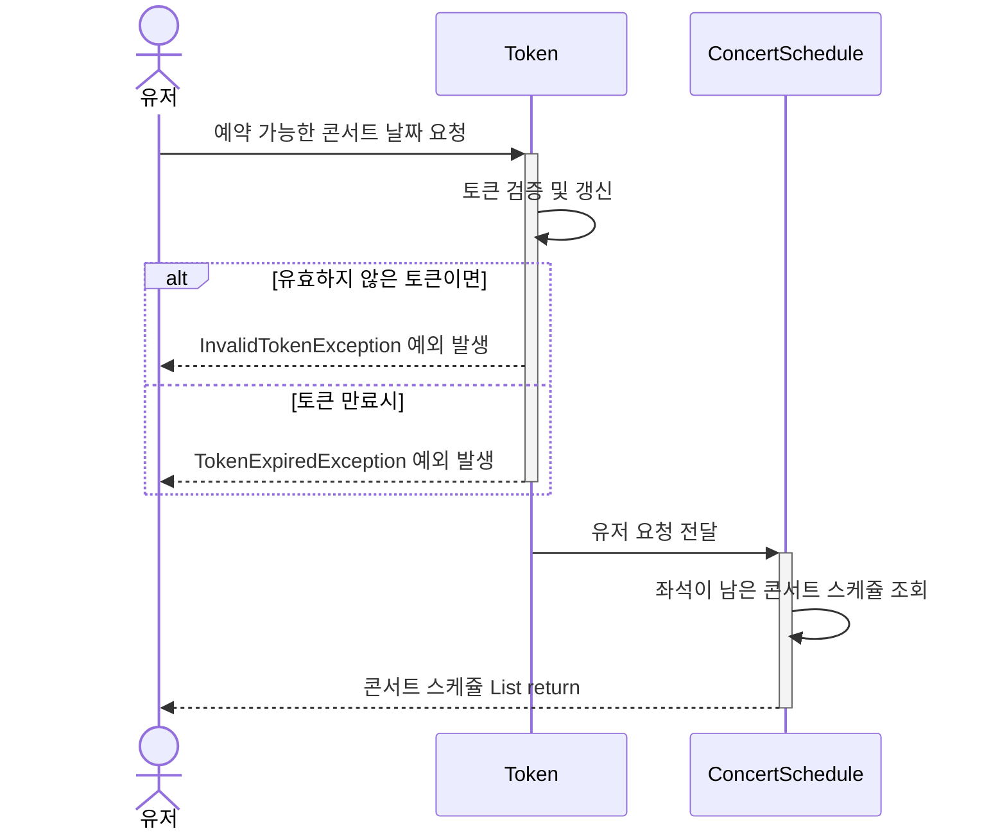
```mermaid
sequenceDiagram
  actor A1 as 유저
  participant Token as Token
  participant ConcertSchedule as ConcertSchedule

  A1 ->>+ Token: 예약 가능한 콘서트 날짜 요청
  Token ->> Token: 토큰 검증 및 갱신
  alt 유효하지 않은 토큰이면
    Token -->> A1: InvalidTokenException 예외 발생
  else 토큰 만료시
    Token -->>- A1: TokenExpiredException 예외 발생
  end
  Token ->>+ ConcertSchedule: 유저 요청 전달
  ConcertSchedule ->> ConcertSchedule: 좌석이 남은 콘서트 스케쥴 조회
  ConcertSchedule -->>- A1: 콘서트 스케쥴 List return
```

## 예약 가능 좌석 조회
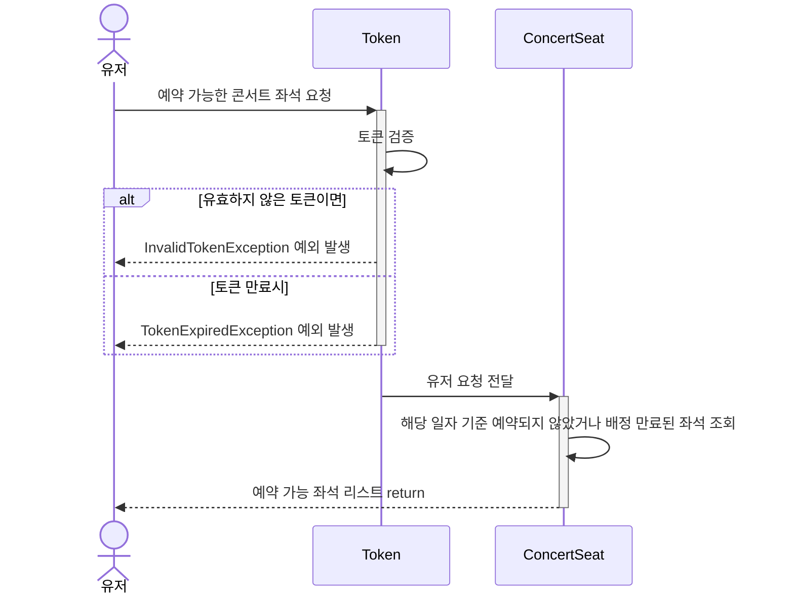
```mermaid
sequenceDiagram
  actor A1 as 유저
  participant Token as Token
  participant ConcertSeat as ConcertSeat

  A1 ->>+ Token: 예약 가능한 콘서트 좌석 요청
  Token ->> Token: 토큰 검증
  alt 유효하지 않은 토큰이면
    Token -->> A1: InvalidTokenException 예외 발생
  else 토큰 만료시
    Token -->>- A1: TokenExpiredException 예외 발생
  end
  Token ->>+ ConcertSeat: 유저 요청 전달
  ConcertSeat ->> ConcertSeat: 해당 일자 기준 예약되지 않았거나 배정 만료된 좌석 조회
  ConcertSeat -->>- A1: 예약 가능 좌석 리스트 return
```

## 좌석 예약 요청 (좌석 임시 배정)
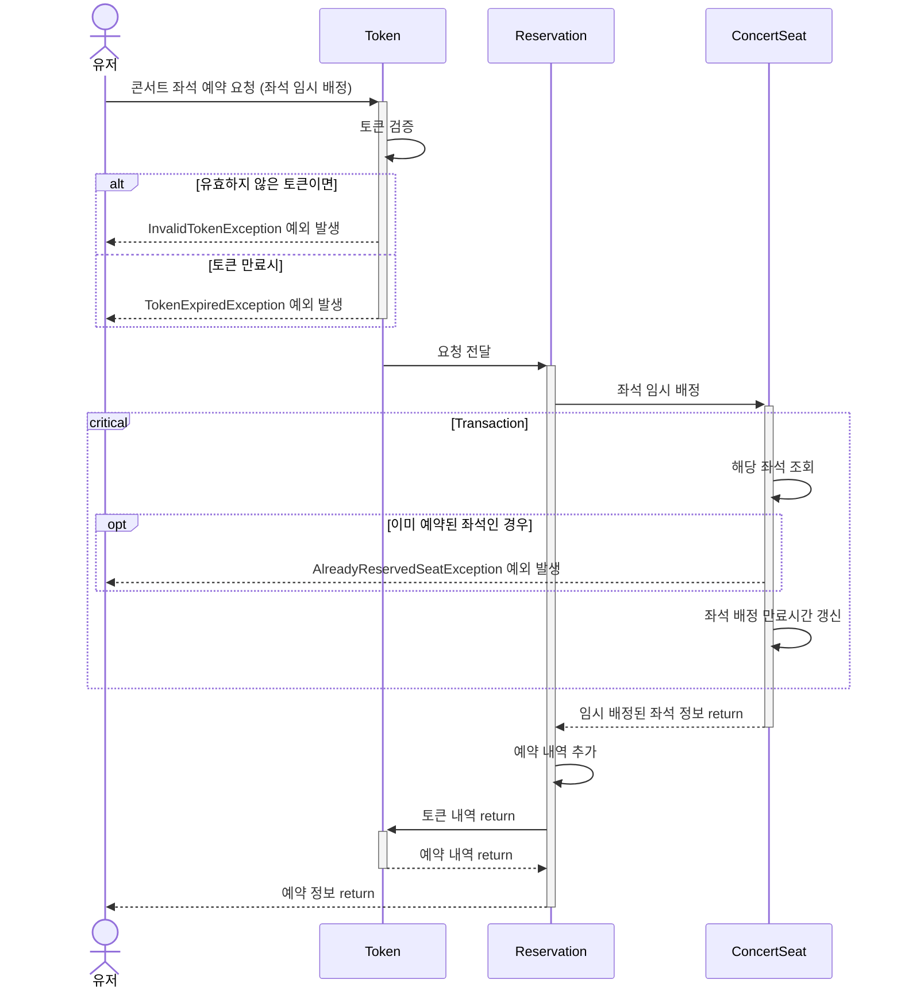
```mermaid
sequenceDiagram
  actor A1 as 유저
  participant Token as Token
  participant Reservation as Reservation
  participant ConcertSeat as ConcertSeat

  A1 ->>+ Token: 콘서트 좌석 예약 요청 (좌석 임시 배정)
  Token ->> Token: 토큰 검증
  alt 유효하지 않은 토큰이면
    Token -->> A1: InvalidTokenException 예외 발생
  else 토큰 만료시
    Token -->>- A1: TokenExpiredException 예외 발생
  end
  Token ->>+ Reservation: 요청 전달
    Reservation ->>+ ConcertSeat: 좌석 임시 배정
  critical Transaction
    ConcertSeat ->> ConcertSeat: 해당 좌석 조회
    opt 이미 예약된 좌석인 경우
        ConcertSeat -->> A1: AlreadyReservedSeatException 예외 발생
    end
      ConcertSeat ->> ConcertSeat: 좌석 배정 만료시간 갱신
  end
  
    ConcertSeat -->>- Reservation: 임시 배정된 좌석 정보 return
    Reservation ->> Reservation: 예약 내역 추가

    Reservation ->>+ Token: 토큰 내역 return
    Token -->>- Reservation: 예약 내역 return

  Reservation -->>- A1: 예약 정보 return
```

## 잔액 조회
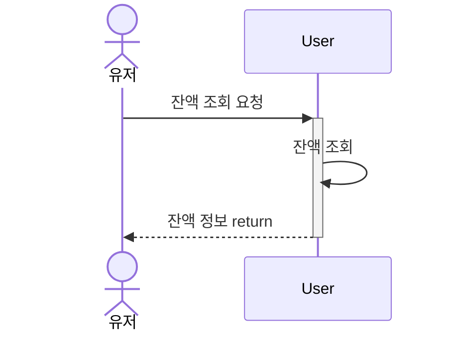
```mermaid
sequenceDiagram
  actor A1 as 유저
  participant User as User

  A1 ->>+ User: 잔액 조회 요청
  User ->> User: 잔액 조회
  User -->>- A1: 잔액 정보 return
```

## 잔액 충전
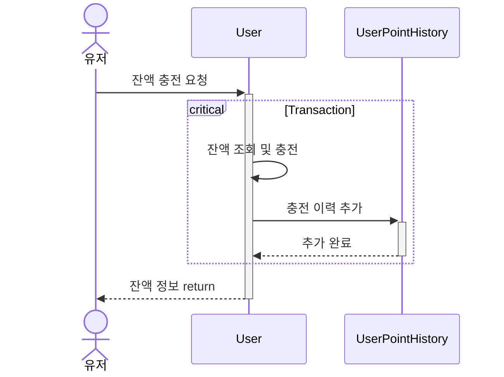
```mermaid
sequenceDiagram
  actor A1 as 유저
  participant User as User
  participant UserPointHistory as UserPointHistory

  A1 ->>+ User: 잔액 충전 요청
  critical Transaction
     User ->> User: 잔액 조회 및 충전
     User ->>+ UserPointHistory: 충전 이력 추가
     UserPointHistory -->>- User: 추가 완료
  end
   User -->>- A1: 잔액 정보 return
```

## 결제 요청
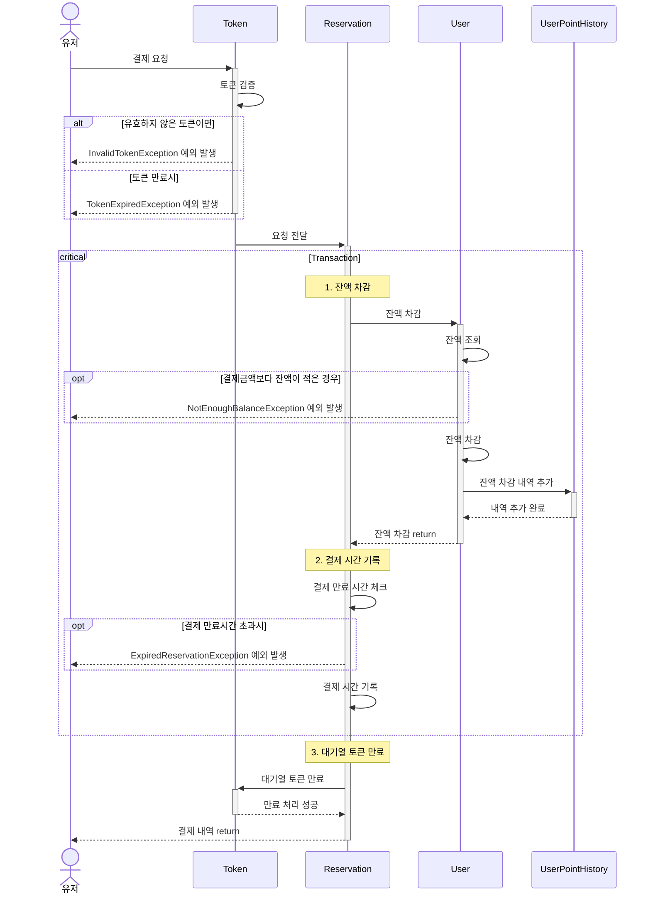
```mermaid
sequenceDiagram
   actor A1 as 유저
   participant Token as Token
   participant Reservation as Reservation
   participant User as User
   participant UserPointHistory as UserPointHistory

    A1 ->>+ Token: 결제 요청
    Token ->> Token: 토큰 검증
    alt 유효하지 않은 토큰이면
        Token -->> A1: InvalidTokenException 예외 발생
    else 토큰 만료시
        Token -->>- A1: TokenExpiredException 예외 발생
    end
    Token ->>+ Reservation: 요청 전달
    
    critical Transaction
        note over Reservation: 1. 잔액 차감
        Reservation ->>+ User: 잔액 차감
        User ->> User: 잔액 조회
        opt 결제금액보다 잔액이 적은 경우
          User-->> A1: NotEnoughBalanceException 예외 발생
        end
        User ->> User: 잔액 차감
        User ->>+ UserPointHistory: 잔액 차감 내역 추가
        UserPointHistory -->>- User: 내역 추가 완료
        User -->>- Reservation: 잔액 차감 return
        
        note over Reservation: 2. 결제 시간 기록
        Reservation ->> Reservation: 결제 만료 시간 체크
        opt 결제 만료시간 초과시
          Reservation -->> A1: ExpiredReservationException 예외 발생
        end
        Reservation ->> Reservation: 결제 시간 기록
    end
    
    note over Reservation: 3. 대기열 토큰 만료
    Reservation ->>+ Token: 대기열 토큰 만료
    Token -->>- Reservation: 만료 처리 성공
    Reservation -->>- A1: 결제 내역 return
```

